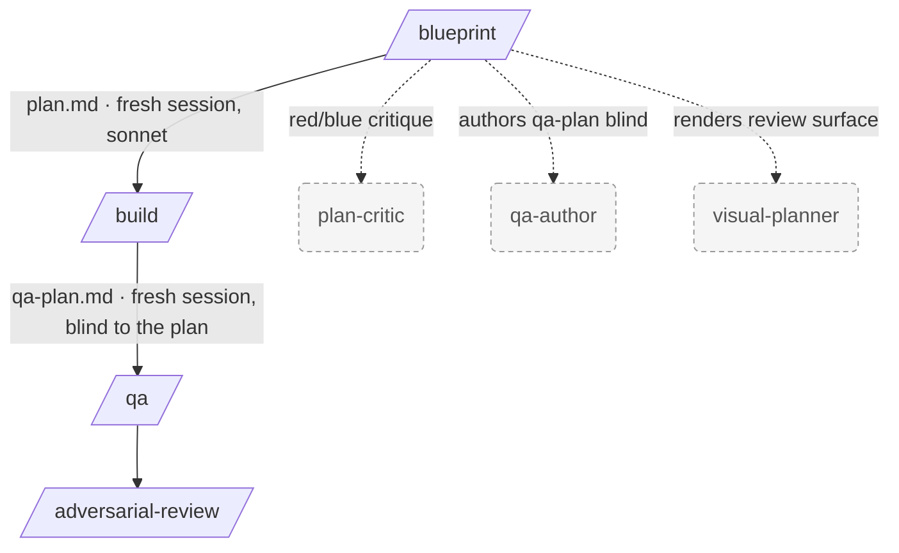
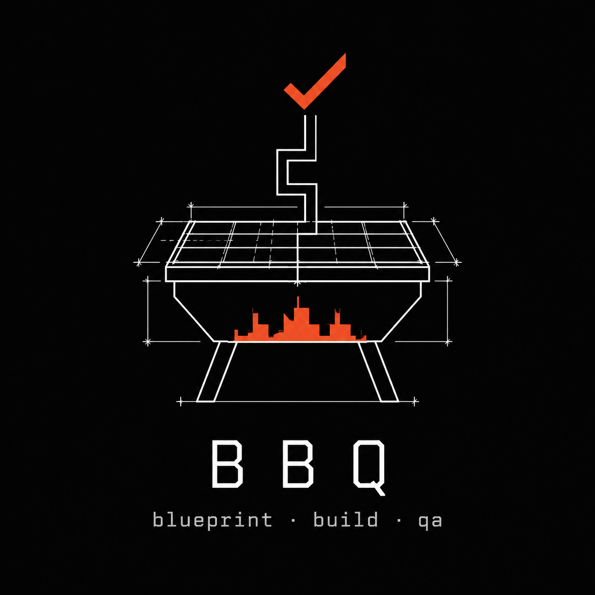

# vpaivag/skills

Personal collection of agent skills covering planning, repo setup, and onboarding workflows.

Each skill is a self-contained `SKILL.md` under `skills/<name>/` that loads on demand when its trigger fires. The planning skills compose into the **BBQ flow** — **B**lueprint → **B**uild → **Q**A:



`/blueprint` is the single front door: it gathers context, gates on whether a genuine design choice exists, and produces a suite — `context.md`, one executable `plan.md`, a `qa-plan.md` authored **blind** from intent alone, and a `visual.html` review surface where you approve or flag the plan in your browser. Execution and QA then run in fresh sessions with deliberately separated knowledge: the executor never does behavioral QA, and QA never sees the plan.

## Contents

- [Install](#install)
  - [Via the skills CLI](#via-the-skills-cli)
  - [As a Claude Code plugin](#as-a-claude-code-plugin)
- [Skills](#skills)
  - [Planning](#planning)
    - [blueprint](#blueprint)
    - [build](#build)
    - [qa](#qa)
  - [Repo setup](#repo-setup)
    - [setup](#setup)
    - [claude-md-refactor](#claude-md-refactor)
  - [Onboarding](#onboarding)
    - [onboarding](#onboarding-1)
  - [Standalone](#standalone)
    - [pr-reviewer](#pr-reviewer)
    - [adversarial-review](#adversarial-review)
- [Agents](#agents)
- [Layout](#layout)
- [Contributing](#contributing)

## Install

Pick the path that matches your setup:

### Via the skills CLI

Manually add the skills to any agent using the [skills CLI](https://github.com/vercel-labs/skills).

Install all skills:

```bash
npx skills@latest add vpaivag/skills
```

Install a specific skill:

```bash
npx skills@latest add vpaivag/skills --skill blueprint
```

Target a specific agent (e.g. Claude Code):

```bash
npx skills@latest add vpaivag/skills -a claude-code
```

Note: the CLI installs skills only — the declared agents (`plan-critic`, `qa-author`, `visual-planner`) and the visual asset library ship with the Claude Code plugin, so `/blueprint`'s subagent stages and `visual.html` need the plugin install below.

### As a Claude Code plugin

This repo is a Claude Code plugin marketplace. Run each command on its own line at the Claude Code prompt:

```
/plugin marketplace add vpaivag/skills
```

```
/plugin install skills@vpaivag
```

```
/reload-plugins
```

The first command registers the marketplace (named `vpaivag`) by fetching `.claude-plugin/marketplace.json` from this repo. The second installs the `skills` plugin from it. The third activates the plugin in your current session — without a restart.

Verify it's registered:

```
/plugin marketplace list
```

If `/plugin install skills@vpaivag` returns `Marketplace "vpaivag" not found`, the `marketplace add` step didn't complete — re-run it and check the output.

Update later:

```
/plugin marketplace update vpaivag
```

Or use a local clone instead of GitHub:

```
/plugin marketplace add /absolute/path/to/skills
```

## Skills

### Planning

<p align="center">
  
</p>

#### blueprint

**Trigger:** `/blueprint <task>`, or asking to plan a task or feature, gather context before implementation, or get a quick/deep plan.

The single planning front door — it replaced the retired `/intake`, `/simple-plan`, and `/deep-plan`. One conversational session takes a task from stated intent to an approved suite: restate → parallel explore fan-out → **batched** Q&A (no question drip) → persist `context.md` → gate.

The gate decides how much process the task deserves:
- **Mechanical path** — no genuine design choice: straight to a single direct plan. Small tasks can optionally be implemented in-session after approval.
- **Design path** — a gate criterion fired (hard-to-reverse, surprising-without-context, real-tradeoff, cross-concern): 2–3 independent proposal agents, each proposal red/blue-critiqued by a split-context `plan-critic` that never sees the codebase or the other proposals, then you pick the direction with the surviving critiques on the table.

Either way the suite ends up with:
- `plan.md` — one executable plan (phases, not chunks; pure text; interfaces and intent, never implementation bodies)
- `qa-plan.md` — behavioral criteria authored by the `qa-author` agent from `context.md` **only**, before and without ever seeing the chosen approach
- `visual.html` — the review surface: file map, phases, contract diffs, diagrams, QA coverage map. Approve or flag sections in the browser; the verdict comes back via `review.json` (File System Access API) or copy-paste.

Run it on a strong model (Opus or Fable) — the handoff commands it prints pin Sonnet for the downstream sessions.

→ [`skills/blueprint`](./skills/blueprint)

#### build

**Trigger:** `/build <suite-dir>` (or the `plan.md` path directly).

Executes the suite's single `plan.md` in a fresh session: read the plan first, confirm with you, implement the phases in order with a checkpoint line at each boundary, then walk the mechanical `AC-n` acceptance criteria (✅/❌ — never claims completion with a ❌). Ends by printing the `/qa` handoff; it never runs behavioral QA itself, because a session that just implemented the code is the wrong judge of whether the code does what was asked.

`/blueprint` prints the exact command with the model baked in: `claude --model sonnet "/build <suite-dir>/plan.md"`.

→ [`skills/build`](./skills/build)

#### qa

**Trigger:** `/qa <suite-dir>`, or asking to "verify the intent" / "test what we asked for, not what we built".

Verifies behavioral intent in a **plan-blind** session: it reads only `qa-plan.md` (and `context.md`) — never `plan.md`, `visual.html`, or the diff — and checks each criterion against the running code from the outside, the way a user would. If the repo has a test setup, criteria become real test files following the repo's conventions, annotated with their `B-n`/`R-n` IDs; if not, criteria are verified live and reported as a manual checklist. Failures are reported as expected-vs-observed divergence, never "fixed" here and never diagnosed by peeking at the implementation.

→ [`skills/qa`](./skills/qa)

### Repo setup

#### setup

**Trigger:** `/setup` or asking to configure where plans live, set up the plans directory, or whether plans should be gitignored.

Writes a small `.claude/plans-config.json` that the planning skills (`/blueprint`, `/build`, `/qa`) consult to find the plans directory. Drives a short Q&A (where plans should live, whether to gitignore them), then writes at most two files: `.claude/plans-config.json` and — if opted in — an entry in `.gitignore`. Planning skills fall back to `.claude/plans` when the config is absent, so running `/setup` is optional.

→ [`skills/setup`](./skills/setup)

#### claude-md-refactor

**Trigger:** mentions of `CLAUDE.md` being too long, bloated, eating context, or asks to set up / audit / split / restructure a `CLAUDE.md` (or `AGENTS.md`-style instructions).

Refactors, audits, or bootstraps a repository's `CLAUDE.md` so it stays a lean **index of pointers** to `/docs/<topic>.md` files instead of bloating every session's context. Applies progressive disclosure: short root file, detail loaded on demand.

Three modes:
- **Audit** an existing `CLAUDE.md` and split it.
- **Bootstrap** a `CLAUDE.md` + `/docs` for a repo that has none.
- **Confirm** a healthy `CLAUDE.md` doesn't need changes (avoids over-editing).

→ [`skills/claude-md-refactor`](./skills/claude-md-refactor)

### Onboarding

#### onboarding

**Trigger:** `/onboarding` or asking for a guided tour of a new codebase / help onboarding.

Ramps a newcomer up on an unfamiliar codebase in three phases: a `CLAUDE.md`-quality gate, a conversational tour driven by `CLAUDE.md` and the docs it points at, and a single contrived hands-on task written to `.claude/onboarding-task.md` so the newcomer can implement it themselves on a sandbox branch. Read-only on the codebase during the tour; writes exactly one artifact. Needs a healthy `CLAUDE.md` to be worthwhile — aborts with a pointer to `/claude-md-refactor` (bootstrap mode) if it's missing, and warns + offers an override if it looks thin.

→ [`skills/onboarding`](./skills/onboarding)

### Standalone

#### pr-reviewer

**Trigger:** asking to review a PR, look at a pull request, do a code review, check a branch before merge, or "what do you think of #123 / this branch?".

Performs a thorough, expert-level pull request review and returns a structured report with issues categorized by severity, including code snippets. Reads surrounding code (not just the diff) before flagging anything, and refuses to fabricate issues.

Hard rules baked in:
- **Never posts to the PR** unless the user explicitly says so after seeing the report.
- **Never modifies the PR's code** — the reviewer reviews, the author authors.

→ [`skills/pr-reviewer`](./skills/pr-reviewer)

#### adversarial-review

**Trigger:** asking for an adversarial review, to stress-test a diff for bugs, "tear this apart", "assume it's broken", "poke holes in this", "red-team this code", or a skeptical second pass on code that was just written.

Adversarial code review built on **split context**, faithful to the [Bun-in-Rust flow](https://bun.com/blog/bun-in-rust#adversarial-review). The Claude that wrote the code wants it accepted, so it's a poor judge of its own work. This skill delegates the reviewing to fresh subagents that see **only the diff** — never the plan or the author's reasoning — and are told to assume the code is wrong and find why. Every suspected defect is then verified against the real code before it reaches you, so the aggressive framing doesn't flood you with false positives.

- **Reviewers see the diff, not the story** — leaking intent is what launders a bug into "looks fine".
- **Report by default** — fixes are applied only if you ask after seeing the findings.

Narrower than `pr-reviewer` (no intent-gathering, no GitHub posting); the natural last step of the planning pipeline, and the lightweight local counterpart to `/code-review ultra`.

→ [`skills/adversarial-review`](./skills/adversarial-review)

## Agents

The plugin ships three declared agents under `agents/`, spawned by `/blueprint` (and invocable directly). Each carries its expertise in its own system prompt and pins the model that fits its role:

| Agent | Model | Role | Deliberately blind to |
|---|---|---|---|
| `plan-critic` | opus | Red/blue critique of one proposal; only attacks that survive its own repair attempt are returned | the codebase, sibling proposals |
| `qa-author` | inherit | Writes `qa-plan.md` from `context.md` alone — criteria test what was *asked*, not what was built | the plan, proposals, all code |
| `visual-planner` | sonnet | Renders the suite into `visual.html` against the block library in `assets/visual/`; adds form, never facts | — |

Split context is the design principle throughout: an agent that hasn't seen the design can't inherit the design's blind spots.

## Layout

```
.claude-plugin/plugin.json
agents/
  plan-critic.md
  qa-author.md
  visual-planner.md
assets/
  visual/            # block library for visual.html: template, blocks.css/js, BLOCKS.md, mermaid (opt-in)
skills/
  adversarial-review/SKILL.md
  claude-md-refactor/SKILL.md
  build/SKILL.md
  qa/SKILL.md
  onboarding/SKILL.md
  blueprint/SKILL.md # + CONTEXT-FORMAT.md, PLAN-FORMAT.md, QA-FORMAT.md
  pr-reviewer/SKILL.md
  setup/SKILL.md
```

## Contributing

Hit unexpected behaviour from one of these skills, or have an idea for an improvement? Open a GitHub issue — that's the channel for both bug reports and proposals.

- **Bug / unexpected behaviour:** use the [Bug report](.github/ISSUE_TEMPLATE/bug_report.md) template. Include the skill name, what you expected, what happened, and a minimal repro if you have one.
- **Improvement / new skill idea:** use the [Improvement](.github/ISSUE_TEMPLATE/improvement.md) template. Describe the use case first, then the proposed change.

PRs are welcome too, but for anything beyond a small fix it's worth opening an issue first so we can align on the approach before you spend time on it.

## Other useful skills

This bundle isn't the only one worth installing. [`mattpocock/skills`](https://github.com/mattpocock/skills) has a great companion set — examples:

- **`grill-me`** — interview-style stress test that drills into a plan or design until every branch of the decision tree is resolved.
- **`improve-codebase-architecture`** — guided pass for spotting and improving structural problems across a codebase.

See the full list at [github.com/mattpocock/skills](https://github.com/mattpocock/skills).

## Acknowledgements

Thanks to [@vavengh](https://github.com/vavengh) — the `/onboarding` skill was his idea, and he's contributed feedback that has helped improve several of the others.

The visual review surface (`visual.html`) is inspired by [BuilderIO/skills](https://github.com/BuilderIO/skills)' `/visual-plan` — reimplemented here as a dependency-free static block library so plans render offline with no toolchain.
