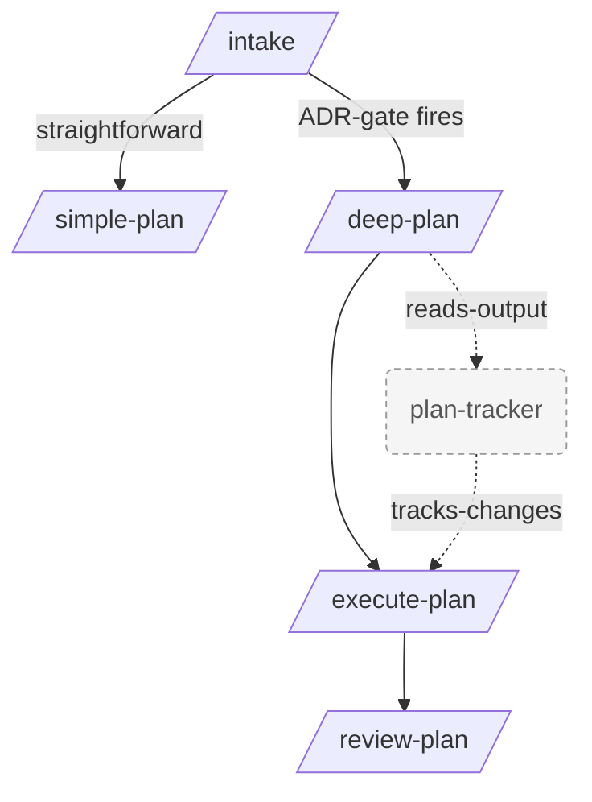

# vpaivag/skills

Personal collection of agent skills covering planning, repo setup, and onboarding workflows.

Each skill is a self-contained `SKILL.md` under `skills/<name>/` that loads on demand when its trigger fires. The planning skills compose into one loop:



_Diagram shows the planning loop; see the clusters below for setup and onboarding skills._

`/intake` is the recommended front door — it gathers context and points you at the right planner. You can still invoke `/deep-plan` or `/simple-plan` directly if you already know which one fits.

## Contents

- [Install](#install)
  - [Via the skills CLI](#via-the-skills-cli)
  - [As a Claude Code plugin](#as-a-claude-code-plugin)
- [Skills](#skills)
  - [Planning](#planning)
    - [intake](#intake)
    - [simple-plan](#simple-plan)
    - [deep-plan](#deep-plan)
    - [execute-plan](#execute-plan)
    - [plan-tracker](#plan-tracker)
    - [review-plan](#review-plan)
  - [Repo setup](#repo-setup)
    - [setup](#setup)
    - [claude-md-refactor](#claude-md-refactor)
  - [Onboarding](#onboarding)
    - [onboarding](#onboarding-1)
  - [Standalone](#standalone)
    - [pr-reviewer](#pr-reviewer)
- [Layout](#layout)
- [Contributing](#contributing)

## Install

Pick the path that matches your setup:

### Via the skills CLI

Manually add the skills to any agent using the [skills CLI](https://github.com/vercel-labs/skills).

Install all skills:

```bash
npx skills@latest add vpaivag/skills
```

Install a specific skill:

```bash
npx skills@latest add vpaivag/skills --skill deep-plan
```

Target a specific agent (e.g. Claude Code):

```bash
npx skills@latest add vpaivag/skills -a claude-code
```

### As a Claude Code plugin

This repo is a Claude Code plugin marketplace. Run each command on its own line at the Claude Code prompt:

```
/plugin marketplace add vpaivag/skills
```

```
/plugin install skills@vpaivag
```

```
/reload-plugins
```

The first command registers the marketplace (named `vpaivag`) by fetching `.claude-plugin/marketplace.json` from this repo. The second installs the `skills` plugin from it. The third activates the plugin in your current session — without a restart.

Verify it's registered:

```
/plugin marketplace list
```

If `/plugin install skills@vpaivag` returns `Marketplace "vpaivag" not found`, the `marketplace add` step didn't complete — re-run it and check the output.

Update later:

```
/plugin marketplace update vpaivag
```

Or use a local clone instead of GitHub:

```
/plugin marketplace add /absolute/path/to/skills
```

## Skills

### Planning

#### intake

**Trigger:** `/intake` or asking to "start a new task", "scope this out", or wanting help deciding whether a task needs a deep plan.

Short, focused Q&A front door for any new task. Asks up to a handful of clarifying questions, writes a `context.md` capturing the task and the resolved assumptions, then **recommends** either `/simple-plan` or `/deep-plan` based on an ADR-gate (hard-to-reverse, surprising-without-context, or real-tradeoff). The downstream planner adopts the same suite directory, so no context is lost between intake and planning.

Highlights:
- **Capped questions.** Won't grill you — gathers just enough to disambiguate.
- **Picks the right planner.** ADR-gate rules pick `/deep-plan` only when it's actually warranted, otherwise routes to `/simple-plan`.
- **Hands off cleanly.** Writes `context.md` into a suite dir the planner picks up automatically.

→ [`skills/intake`](./skills/intake)

#### simple-plan

**Trigger:** `/simple-plan` or asking for a lightweight plan for a straightforward task.

Lightweight planner for mechanical or bounded tasks where `/deep-plan`'s full Restate → Explore → Design → Specify → Risk → Verify treatment is overkill. Produces a single `simple-plan.md` in a suite directory and, if you approve, implements it in the same session — no `/execute-plan` handoff, no chunk decomposition, no `index.md` (so `/plan-tracker` and `/execute-plan` ignore it by design).

Use this when the work is mechanical (rename a field across a codebase), a small bug fix, a one-file addition, or otherwise lacks real design choices. If a task turns out to be deeper than expected, switch to `/deep-plan`.

→ [`skills/simple-plan`](./skills/simple-plan)

#### deep-plan

**Trigger:** `/deep-plan` or asking for a deep/thorough plan before implementation.

Produces a rigorous, self-contained implementation plan for a coding task. Explores the codebase read-only, considers alternatives, enumerates risks, and writes a **plan suite** — a directory containing an `index.md` plus one or more chunk files — that can be picked up and executed by a fresh Claude Code session with no prior conversation context.

Highlights:
- **Read-only during planning.** No edits, no git mutations, no side effects until the final write phase.
- **Adopts intake context when present.** If invoked on (or after) an `/intake` run, it picks up the suite dir and seeds Restate from `context.md`. Works standalone too.
- **User checkpoint on real tradeoffs.** When ≥2 alternatives are genuinely viable, asks you which to plan instead of locking in silently.
- **Detects under-decomposition.** Suggests splits when a plan contains multiple internally-coherent units of work.
- **Hand-off ready.** Output is designed to be executed via `/execute-plan` with zero context loss.

→ [`skills/deep-plan`](./skills/deep-plan)

#### execute-plan

**Trigger:** `/execute-plan <path-to-chunk-file>`.

Executes a chunk file produced by `/deep-plan`. Reads the specified chunk, validates suite dependencies via the suite index, confirms the file list and order with the user, implements changes in sequence, verifies each acceptance criterion, and prompts for the final status update on the suite.

Works on both single-chunk suites (`plan.md`) and individual chunks of a multi-chunk suite.

→ [`skills/execute-plan`](./skills/execute-plan)

#### plan-tracker

**Trigger:** `/plan-tracker` or questions like "what's the state of the plan?", "what's next?", "what's left?".

Read-only status view for plan suites in the current project. Detects the active suite, shows per-chunk status and dependency relationships, and surfaces what's runnable next. Never modifies plan files.

→ [`skills/plan-tracker`](./skills/plan-tracker)

#### review-plan

**Trigger:** `/review-plan` or asking "is the plan actually done?", "did we deliver what the plan promised?", "is the suite status honest?".

Read-only audit that closes the planning loop. Compares a suite's `index.md` goal and per-chunk acceptance criteria against the actual git diff since the suite was created, then reports goal alignment, coverage gaps, drift (changes not traceable to any chunk), and status-sanity issues (chunks marked `done` whose criteria don't appear satisfied in the code).

Pairs with `plan-tracker`: tracker shows recorded status, review-plan checks whether that status is telling the truth. Never edits the plan, never marks chunks done, never touches code.

→ [`skills/review-plan`](./skills/review-plan)

### Repo setup

#### setup

**Trigger:** `/setup` or asking to configure where plans live, set up the plans directory, or whether plans should be gitignored.

Writes a small `.claude/plans-config.json` that the planning skills (`/intake`, `/deep-plan`, `/simple-plan`, `/plan-tracker`, `/execute-plan`, `/review-plan`) consult to find the plans directory. Drives a short Q&A (where plans should live, whether to gitignore them), then writes at most two files: `.claude/plans-config.json` and — if opted in — an entry in `.gitignore`. Planning skills fall back to `.claude/plans` when the config is absent, so running `/setup` is optional.

→ [`skills/setup`](./skills/setup)

#### claude-md-refactor

**Trigger:** mentions of `CLAUDE.md` being too long, bloated, eating context, or asks to set up / audit / split / restructure a `CLAUDE.md` (or `AGENTS.md`-style instructions).

Refactors, audits, or bootstraps a repository's `CLAUDE.md` so it stays a lean **index of pointers** to `/docs/<topic>.md` files instead of bloating every session's context. Applies progressive disclosure: short root file, detail loaded on demand.

Three modes:
- **Audit** an existing `CLAUDE.md` and split it.
- **Bootstrap** a `CLAUDE.md` + `/docs` for a repo that has none.
- **Confirm** a healthy `CLAUDE.md` doesn't need changes (avoids over-editing).

→ [`skills/claude-md-refactor`](./skills/claude-md-refactor)

### Onboarding

#### onboarding

**Trigger:** `/onboarding` or asking for a guided tour of a new codebase / help onboarding.

Ramps a newcomer up on an unfamiliar codebase in three phases: a `CLAUDE.md`-quality gate, a conversational tour driven by `CLAUDE.md` and the docs it points at, and a single contrived hands-on task written to `.claude/onboarding-task.md` so the newcomer can implement it themselves on a sandbox branch. Read-only on the codebase during the tour; writes exactly one artifact. Needs a healthy `CLAUDE.md` to be worthwhile — aborts with a pointer to `/claude-md-refactor` (bootstrap mode) if it's missing, and warns + offers an override if it looks thin.

→ [`skills/onboarding`](./skills/onboarding)

### Standalone

#### pr-reviewer

**Trigger:** asking to review a PR, look at a pull request, do a code review, check a branch before merge, or "what do you think of #123 / this branch?".

Performs a thorough, expert-level pull request review and returns a structured report with issues categorized by severity, including code snippets. Reads surrounding code (not just the diff) before flagging anything, and refuses to fabricate issues.

Hard rules baked in:
- **Never posts to the PR** unless the user explicitly says so after seeing the report.
- **Never modifies the PR's code** — the reviewer reviews, the author authors.

→ [`skills/pr-reviewer`](./skills/pr-reviewer)

## Other useful skills

This bundle isn't the only one worth installing. [`mattpocock/skills`](https://github.com/mattpocock/skills) has a great companion set — examples:

- **`grill-me`** — interview-style stress test that drills into a plan or design until every branch of the decision tree is resolved.
- **`improve-codebase-architecture`** — guided pass for spotting and improving structural problems across a codebase.

See the full list at [github.com/mattpocock/skills](https://github.com/mattpocock/skills).

## Layout

```
.claude-plugin/plugin.json
skills/
  claude-md-refactor/SKILL.md
  deep-plan/SKILL.md
  execute-plan/SKILL.md
  intake/SKILL.md
  onboarding/SKILL.md
  plan-tracker/SKILL.md
  pr-reviewer/SKILL.md
  review-plan/SKILL.md
  setup/SKILL.md
  simple-plan/SKILL.md
```

## Contributing

Hit unexpected behaviour from one of these skills, or have an idea for an improvement? Open a GitHub issue — that's the channel for both bug reports and proposals.

- **Bug / unexpected behaviour:** use the [Bug report](.github/ISSUE_TEMPLATE/bug_report.md) template. Include the skill name, what you expected, what happened, and a minimal repro if you have one.
- **Improvement / new skill idea:** use the [Improvement](.github/ISSUE_TEMPLATE/improvement.md) template. Describe the use case first, then the proposed change.

PRs are welcome too, but for anything beyond a small fix it's worth opening an issue first so we can align on the approach before you spend time on it.

## Acknowledgements

Thanks to [@vavengh](https://github.com/vavengh) — the `/onboarding` skill was his idea, and he's contributed feedback that has helped improve several of the others.
